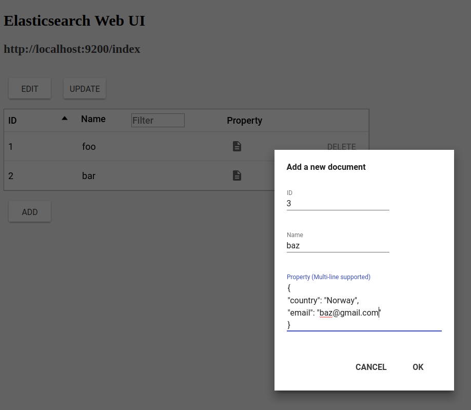
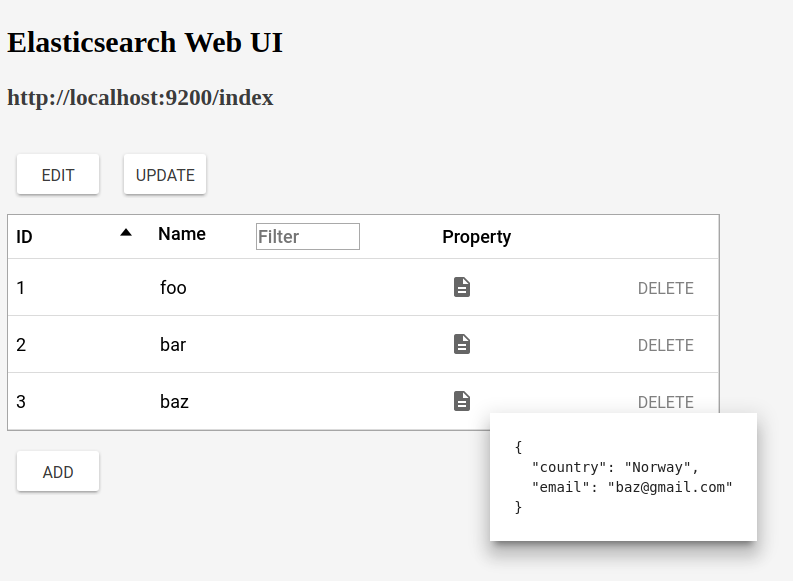
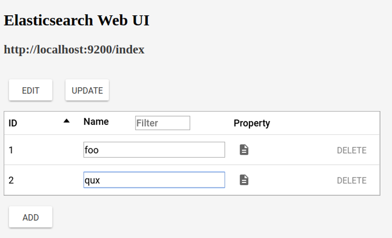

# elasticsearch-web-ui

A material design WebUI for Elasticsearch 6.0.0 with basic features CRUD, sorting and filtering.

## Usage

1. Install and run Elasticsearch.

2. Install Polymer-CLI and bower. Use `bower install` to install necessary components and then run `polymer serve` to serve this webapp locally.

## Screenshots

Creating a new document:

Showing a JSON field:

Editing a document name:

